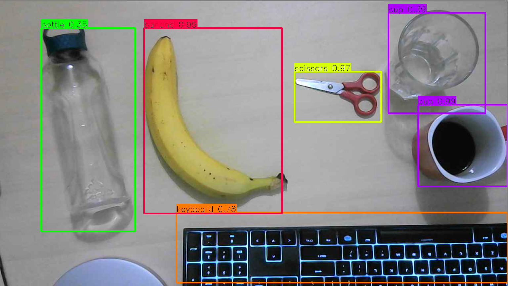

# Real Time Object Detection using YOLO


The purpose of this project is the development of a Python application, which is looking for a Webcam and turns it on using **opencv**. Afterwards it captures a frame and uses **YOLO** Computer Vision model to detect the objects in this frame. The objects are shown in the image with bounding boxes and their prediction confidence score.


<p allign = "center">
    
</p>


----


To test the code yourself you should:


- Clone the repository: 

  ```git clone https://github.com/pythonlessons/YOLOv3-object-detection-tutorial.git
  git clone https://github.com/exarchou/YOLO-Object-Recognition
  ```

- Download YOLO pretrained weights:

  ```
  wget https://pjreddie.com/media/files/yolov3.weights
  ```

- Convert from Darknet to Keras model:

  ```
  python convert.py model_data/yolov3.cfg model_data/yolov3.weights model_data/yolo_weights.h
  ```

- Execute main loop:

  ```
  python main.py
  ```

  

To use tensorflow-gpu, you should have installed cuDNN: https://www.tensorflow.org/install/gpu


### Authors

[Dimitrios-Marios Exarchou](https://github.com/exarchou) 
